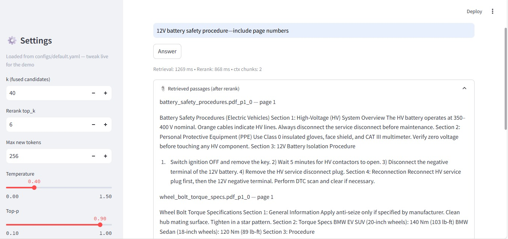

# PoC — Offline RAG + Generative AI Demo

### A Dual-Pipeline AI Sandbox built for Automotive Knowledge Intelligence and Synthetic Data Generation

---

## Overview

This Proof of Concept (PoC) demonstrates a **fully offline, end-to-end AI stack** that combines:

1. **Retrieval-Augmented Generation (RAG)** — for intelligent document understanding and question answering over internal PDFs.  
2. **Generative Adversarial Networks (DCGAN)** — for local image synthesis and experimentation in data generation.

All components run **locally on CPU/GPU**, using open-source models and frameworks (PyTorch, FAISS, BM25, llama.cpp).  
No internet or API dependency — ideal for secure, on-premises use cases such as automotive R&D data environments**.

---

## System Architecture

### **1. Retrieval-Augmented Generation (RAG)**

#### **Goal**
Enable intelligent, citation-grounded answers from internal PDFs using local models.

#### **Pipeline Flow**

```
PDFs → Text Extraction → Chunking → Embedding
       ↓
   FAISS (dense) + BM25 (sparse)
       ↓
 Hybrid Fusion + Cross-Encoder Reranking
       ↓
 TinyLlama GGUF → Grounded Answer Generation
```

#### **Modules**
| Stage | File | Description |
|--------|------|-------------|
| **Ingest** | `rag/ingest.py` | Extracts text from PDFs, chunks text, builds FAISS and BM25 indexes. |
| **Retrieve** | `rag/retrieve.py` | Combines dense (semantic) and sparse (keyword) retrieval results. |
| **Rerank** | `rag/rerank.py` | Cross-encoder model (`ms-marco-MiniLM-L6-v2`) ranks final passages. |
| **Generate** | `rag/generate.py` | TinyLlama GGUF model (via llama.cpp) produces contextual answers. |
| **Guardrails** | `rag/guardrails.py` | Cleans and filters sensitive or irrelevant responses. |
| **Eval** | `rag/eval.py` | Reports latency metrics and pipeline statistics. |

#### **Retrieval Config (YAML)**

```yaml
retrieval:
  k_dense: 50
  k_bm25: 50
  k_fused: 40
  dense_weight: 0.65
  bm25_weight: 0.35

rerank:
  top_k: 6
```

**Why this matters:**  
- FAISS captures semantic similarity.  
- BM25 ensures keyword coverage.  
- Cross-Encoder refines relevance.  
- Fusion balances precision and recall — a practical hybrid used in enterprise RAG systems.

---

### **2. Generative Component (DCGAN)**

#### **Goal**
Showcase a fast, local generative model that can create synthetic grayscale images — useful for concept demos or automotive data simulation.

#### **Architecture**
| Network | File | Description |
|----------|------|-------------|
| **Generator** | `generative/gan_dcgan.py` | Converts random noise (latent vector) into 32×32 images via transposed convolutions. |
| **Discriminator** | `generative/gan_dcgan.py` | Classifies images as real or fake via convolutional layers and global pooling. |

#### **Training Workflow**
1. Dataset → Fashion-MNIST or Custom grayscale icons.  
2. Alternate between:
   - **D-Step:** Train discriminator on real + fake samples.
   - **G-Step:** Train generator to fool the discriminator.
3. Save:
   - Checkpoint → `data/generated/dcgan/dcgan_latest.pt`
   - Preview grid → `data/generated/dcgan/preview.png`

**Core Hyperparameters**
```python
epochs = 2
lr = 2e-4
nz = 32
img_size = 32
batch_size = 128
```

---

## Streamlit UI

The Streamlit dashboard acts as the control center — unifying the RAG and GAN pipelines.

### **Sidebar — Model & Inference Configuration**

| Parameter | Description | Range / Default |
|------------|-------------|----------------|
| **k (fused candidates)** | No. of top chunks retained after fusion | 20–60 (default: 40) |
| **Rerank top_k** | Chunks passed to cross-encoder | 4–10 (default: 6) |
| **Max new tokens** | LLM output length limit | 128–512 |
| **Temperature** | Sampling randomness | 0.2–0.7 |
| **Top-p** | Nucleus sampling threshold | 0.8–0.95 |

---

### **Tabs Overview**

#### **Ingest PDFs**
Upload files → click **Build / Rebuild Indexes**.  
Creates FAISS + BM25 indexes and saves metadata in JSONL.

#### **Search & Answer**
Ask questions → retrieves, reranks, and generates grounded answers from the ingested PDFs.  
Citations like `[id p2]` show where the answer came from.

#### **Metrics**
Displays latency (p50/p95) for retrieval and reranking.  
Future extension for Recall@k, nDCG, and Faithfulness metrics.

#### **Inspect Index**
Preview ~50 text chunks from the FAISS/BM25 indexes for data verification.

#### **Generative (DCGAN)**
Train or sample from a local GAN.
- **Quick Demo:** Fashion-MNIST (auto-downloaded)
- **Fine-Tune Mode:** Uses images from `data/custom_images/`

Buttons:
- **Train** → Trains DCGAN (logs to console)
- **Generate Now** → Produces image grid + downloadable ZIP

---

## Folder Structure

```
poc-bmw/
│
├── app/                     # Streamlit entry point and dependency manager
├── rag/                     # Ingestion, retrieval, rerank, generation, guardrails
├── generative/              # DCGAN and dataset generator scripts
├── ui/                      # Streamlit UI components and layout
├── configs/                 # YAML configs (paths, retrieval, generation)
├── models/                  # GGUF + transformer models
├── data/
│   ├── raw/                 # Input PDFs
│   ├── index/               # FAISS / BM25 indexes
│   └── generated/dcgan/     # GAN checkpoints and previews
└── README.md
```

---

## Configuration (`configs/default.yaml`)

```yaml
paths:
  raw_dir: "data/raw"
  index_dir: "data/index"
  gguf_model: "models/gguf/tinyllama-1.1b-chat-v1.0.Q4_K_M.gguf"

chunking:
  size: 600
  overlap: 80

retrieval:
  k_dense: 50
  k_bm25: 50
  k_fused: 40
  dense_weight: 0.65
  bm25_weight: 0.35

rerank:
  top_k: 6

generation:
  max_new_tokens: 256
  temperature: 0.4
  top_p: 0.9
```

---

## Key Artifacts

| Artifact | Description | Path |
|-----------|--------------|------|
| **FAISS Index** | Dense vector index | `data/index/text.faiss` |
| **BM25 Index** | Sparse keyword index | `data/index/bm25.pkl` |
| **Chunk Map** | JSONL mapping of text chunks | `data/index/text_ids.jsonl` |
| **DCGAN Checkpoint** | Latest model weights | `data/generated/dcgan/dcgan_latest.pt` |
| **Preview Image** | DCGAN grid snapshot | `data/generated/dcgan/preview.png` |

---

## How to Run

```bash
# 1. Install dependencies
pip install -r requirements.txt

# 2. Launch the Streamlit app
streamlit run ui/streamlit_app.py

# 3. Access UI at
http://localhost:8501
```

**Steps:**
1. In “Ingest PDFs” → upload files → Build Index.  
2. In “Search & Answer” → type queries → view contextual responses.  
3. In “Generative” → train or generate images via DCGAN.

---

## Technology Stack

| Component | Technology |
|------------|-------------|
| **UI Layer** | Streamlit |
| **Vector Store** | FAISS (dense) + BM25 (sparse) |
| **Embedding Model** | SentenceTransformer – all-MiniLM-L6-v2 |
| **Reranker** | Cross-Encoder – ms-marco-MiniLM-L6-v2 |
| **LLM** | TinyLlama (GGUF, via llama.cpp) |
| **Framework** | PyTorch |
| **Generative Model** | DCGAN |

## UI Snapshots




